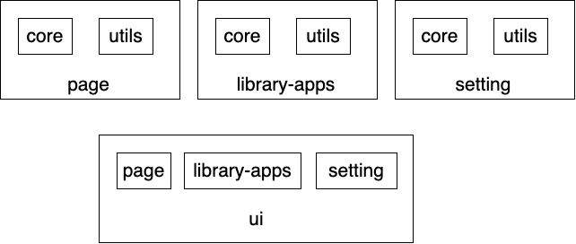

# BeanBagDB-svelte-components

## Svelte related commands :
- the repo was created using [`create-svelte`](https://github.com/sveltejs/kit/tree/main/packages/create-svelte)
- Svelte [docs](https://svelte.dev/docs/kit/packaging)
- for dev :
  - clone the repo
  - cd into repo 
  - run : `npm install`
  - to run dev : `npm run dev -- --open`
- Everything inside `src/lib` is part of the library
- to build library : `npm run package` , `npm run build` (for production) (this is just for testing locally, it is published to npm using github workflow)


## List of components categories :
- `db`: (not a component)
  - `BeanBagDBWeb.js` : The web version of BanBagDB that uses PouchDB to store data locally in the user's web browser with an option to sync with a CouchDB instance 
- `core` : the core components for BeanBagDB. This include :
  - The components defined here use a consistent input format : {data,options}. They components are "dumb" in the sense that they do perform any data fetching. They just display using what is provided to them 
  - Naming convention : ActionType (Action=New,Search,Edit; Type=Doc,DocMeta,DocResults)
  - `NewDoc` : Displays a form to create a new document 
  - `SearchDocResults` : Displays the results of a document search query.
  - `SearchQuery`: Displays a form to generate a search query for the database.
  - `EditDoc`: Displays a form to edit a give document
  - `EditDocMeta`  : Form to edit metadata of the document
  - `ViewDoc` : To view a document in  html 
- `util` : this repo also contain "dumb" components that takes data displays something and returns some output. These are used in assembling other components 
  - `SchemaEditor` 
  - `SettingEditor`
  - `KeyEditor`
  - `LogViewer`
  - `TextEditor`
  - `JSONEditor`
- `page`
- `library`
- `setting`
- `ui`

The basic architecture of building User interfaces using basic components are defined in the figure below : 




Core, util components are the base components using which pages, apps and setting pages are built. UI component provide a logical interface for users to interact with their database 


Custom data editor :

```{svelte}
<script>
  import { onMount } from "svelte";
  import { emit_bbdb_event, load_editor } from "../bbdb_actions.js";

  let { doc = {}, schema = {}, mode = "view", BBDB, bbdb_action } = $props();
  let loaded = $state(false);
  let data = $state({});

  let new_doc = $state(false)
  let blank_data = $state({})

  onMount(async () => {
    let opt = load_editor({ doc, schema, mode });
    new_doc = opt.new_doc
    blank_data = opt.blank_data
    if (new_doc) {
      data = {...blank_data};
      mode = "edit";
    } else {
      data = doc.data;
    }
    loaded = true;
  });
</script>
{#if loaded}
{#if mode === "view"}
  View
{:else if mode == "edit"}
  Edit
{/if}
{/if}
```